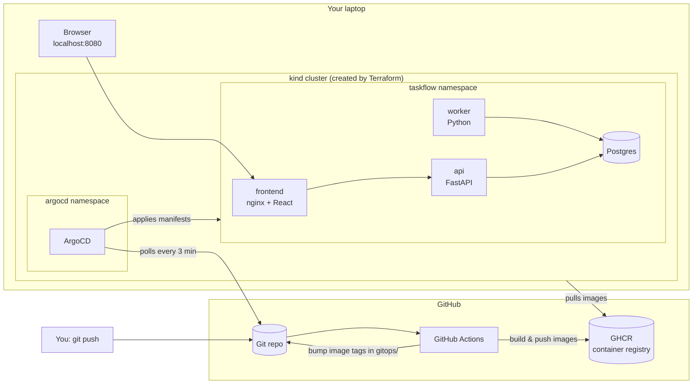

# DevOps POC — TaskFlow

A hands-on DevOps learning project that runs **entirely on your laptop** (no cloud
account needed) but uses the exact same tools and workflow you'd use in production:
Docker, Kubernetes, Terraform, GitHub Actions, and ArgoCD (GitOps).

The app itself, **TaskFlow**, is deliberately simple: you create tasks in a web UI,
a background worker picks them up and "processes" them. It exists to give the
pipeline something real to build and deploy.

## Architecture



**The GitOps loop in one sentence:** you push code → CI builds images and commits the
new image tags into `gitops/` → ArgoCD notices the git change and updates the cluster.
Nobody ever runs `kubectl apply` by hand.

## Repo layout

| Path | What | Lifecycle |
|---|---|---|
| `apps/` | Application source code (frontend, api, worker) + Dockerfiles | Continuous — every push builds |
| `gitops/` | Kubernetes manifests (Kustomize). **This is what ArgoCD watches.** | Continuous — CI updates image tags |
| `infra/terraform/` | kind cluster + ArgoCD install | **One-time bootstrap**, run manually |
| `.github/workflows/` | CI pipeline | Runs on GitHub |
| `docker-compose.yml` | Local dev without Kubernetes | Dev convenience |

## Prerequisites

Docker Desktop, `kind`, `terraform`, `kubectl`, `helm`, and a GitHub account.
(All already installed if you're the repo author.)

---

## Phase 0 — Run the app locally (no Kubernetes)

Verify the app itself works before adding any orchestration:

```sh
docker compose up --build
```

- Frontend: <http://localhost:8080>
- API docs (Swagger): <http://localhost:8000/docs>

Add a task in the UI → status goes `Pending → Processing → Done` within ~5s
(the worker is doing that). `Ctrl-C` and `docker compose down` when satisfied.

## Phase 1 — Push to GitHub

Create a **public** repo on GitHub named `devops-poc` (public keeps GHCR image pulls
and ArgoCD repo access credential-free — fine for a POC with no real secrets), then:

```sh
git init -b main
git add .
git commit -m "initial commit: taskflow app + gitops + terraform"
git remote add origin https://github.com/YOUR_USERNAME/devops-poc.git
git push -u origin main
```

The push triggers the CI workflow: watch it under the repo's **Actions** tab. It will

1. run the API tests,
2. build all three images and push them to `ghcr.io/YOUR_USERNAME/devops-poc-*`,
3. commit updated image tags into `gitops/overlays/dev/kustomization.yaml`
   (you'll see a bot commit appear — `git pull` to get it locally).

## Phase 2 — Make the GHCR packages public (one-time)

GHCR images are **private by default**, and the kind cluster has no GHCR credentials.
After the first CI run: GitHub → your profile → **Packages** → each `devops-poc-*`
package → **Package settings** → Danger Zone → **Change visibility → Public**.

(Alternative for private images: create a `docker-registry` pull secret in the
`taskflow` namespace and reference it via `imagePullSecrets` — a good later exercise.)

## Phase 3 — Terraform: create the cluster + install ArgoCD

```sh
cd infra/terraform
cp terraform.tfvars.example terraform.tfvars   # then edit: set your repo URL
terraform init
terraform plan     # read what it's about to do — this is the IaC habit
terraform apply
```

This creates a 2-node kind cluster, installs ArgoCD via Helm, and registers the
`taskflow` ArgoCD Application pointing at `gitops/overlays/dev` in your repo.
Takes a few minutes.

```sh
kubectl config use-context kind-devops-poc
kubectl get pods -A        # argocd pods should be Running
```

## Phase 4 — Watch ArgoCD do its thing

```sh
# ArgoCD UI
kubectl -n argocd port-forward svc/argocd-server 8443:443
# password:
kubectl -n argocd get secret argocd-initial-admin-secret -o jsonpath="{.data.password}" | base64 -d
```

Open <https://localhost:8443> (accept the self-signed cert), log in as `admin`.
You'll see the `taskflow` application sync: ArgoCD creates the namespace, Postgres,
API, worker, and frontend from git. When it's green/Healthy:

**App is live at <http://localhost:8080>** — served from Kubernetes this time.

## Phase 5 — The full loop: make a change

1. Edit something visible, e.g. the `<h1>` in `apps/frontend/src/App.jsx`.
2. `git add . && git commit -m "change heading" && git push`
3. Watch: Actions builds → bot commit bumps the image tag → ArgoCD (polls every ~3 min,
   or hit **Refresh** in the UI) syncs → refresh <http://localhost:8080>.

You just did a production-grade deployment with zero manual steps. 🎉

Also try **self-heal**: `kubectl -n taskflow scale deploy/frontend --replicas=3` and
watch ArgoCD revert it to what git says within moments. Git is the source of truth.

## Everyday commands

```sh
kubectl -n taskflow get pods                 # what's running
kubectl -n taskflow logs deploy/worker -f    # watch the worker process tasks
kubectl -n taskflow describe pod <name>      # debugging (image pulls, probes)
terraform destroy                            # tear the whole cluster down
docker compose up --build                    # fast local iteration, no k8s
```

If the cluster dies or gets weird: `terraform destroy && terraform apply` rebuilds
everything from scratch in minutes. That disposability is the point of IaC.

## Troubleshooting

| Symptom | Likely cause / fix |
|---|---|
| Pods stuck `ImagePullBackOff` | GHCR packages still private (Phase 2), or `CHANGE_ME` still in `gitops/overlays/dev/kustomization.yaml` (CI hasn't run yet). |
| ArgoCD app `ComparisonError` | Wrong `gitops_repo_url` in `terraform.tfvars`, or repo is private. Fix var, `terraform apply`. |
| `terraform apply` fails creating cluster | Docker Desktop not running. |
| App at :8080 shows API error | `kubectl -n taskflow get pods` — Postgres or API probably still starting. |
| CI push to gitops fails (403) | Repo → Settings → Actions → General → Workflow permissions → **Read and write**. |

## Where to go next (learning exercises, roughly in order)

1. **Second environment** — add `gitops/overlays/staging` with different replica
   counts, register a second ArgoCD Application. Teaches Kustomize overlays properly.
2. **Ingress** — install ingress-nginx and replace the NodePort with an Ingress +
   host-based routing. This is how real clusters expose services.
3. **New service** — add a `stats` service (e.g. FastAPI endpoint returning task
   counts) end-to-end: Dockerfile → CI matrix → manifests → ArgoCD syncs it.
   This proves you understand the whole pipeline.
4. **Secrets done right** — replace the plaintext Secret in `gitops/base/postgres.yaml`
   with [Sealed Secrets](https://github.com/bitnami-labs/sealed-secrets).
5. **DB migrations** — replace `create_all()` with Alembic, run it as an init
   container or ArgoCD sync hook (Job).
6. **Monitoring** — install kube-prometheus-stack via a second ArgoCD app, add a
   `/metrics` endpoint to the API, build a Grafana dashboard.
7. **App-of-apps** — restructure so one root ArgoCD Application manages the others.
8. **Then Azure** — when you get cloud access, swap `infra/terraform` kind resources
   for an AKS module and change almost nothing else. That's the payoff of this design.
